# Available Emojis

This folder contains the animated emojis available in Lyrics Reader. Each row shows a preview, the display name, and the corresponding filename.

The default emoji can be changed in [`data/default_emoji.txt`](data/default_emoji.txt). Replace its contents with the filename of any included GIF, for example `cray.gif`.

| Emoji | Nombre | Archivo |
| --- | --- | --- |
|  | acute | `acute.gif` |
|  | aggressive | `aggressive.gif` |
|  | air kiss | `air_kiss.gif` |
|  | angel | `angel.gif` |
|  | bad | `bad.gif` |
|  | bb | `bb.gif` |
| 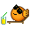 | beach | `beach.gif` |
|  | beee | `beee.gif` |
|  | big grin | `biggrin.gif` |
|  | big boss | `big_boss.gif` |
|  | blum3 | `blum3.gif` |
|  | blush | `blush.gif` |
|  | boast | `boast.gif` |
| 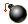 | bomb | `bomb.gif` |
|  | boredom | `boredom.gif` |
|  | buba | `buba.gif` |
|  | buba phone | `buba_phone.gif` |
|  | bye | `bye.gif` |
|  | clapping | `clapping.gif` |
|  | cray | `cray.gif` |
|  | cray2 | `cray2.gif` |
|  | crazy | `crazy.gif` |
|  | curtsey | `curtsey.gif` |
|  | dance | `dance.gif` |
|  | dance2 | `dance2.gif` |
|  | dance3 | `dance3.gif` |
|  | dance4 | `dance4.gif` |
|  | dash1 | `dash1.gif` |
|  | dash2 | `dash2.gif` |
| 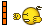 | dash3 | `dash3.gif` |
|  | declare | `declare.gif` |
|  | dirol | `dirol.gif` |
|  | don't mention | `don-t_mention.gif` |
|  | download | `download.gif` |
|  | drinks | `drinks.gif` |
| 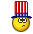 | english en | `english_en.gif` |
|  | facepalm | `facepalm.gif` |
| 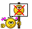 | feminist | `feminist.gif` |
|  | feminist en | `feminist_en.gif` |
|  | first move | `first_move.gif` |
|  | flirt | `flirt.gif` |
|  | focus | `focus.gif` |
|  | fool | `fool.gif` |
|  | friends | `friends.gif` |
|  | gamer1 | `gamer1.gif` |
|  | gamer2 | `gamer2.gif` |
|  | gamer3 | `gamer3.gif` |
| 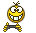 | gamer4 | `gamer4.gif` |
|  | girl blum | `girl_blum.gif` |
|  | girl cray | `girl_cray.gif` |
|  | girl cray2 | `girl_cray2.gif` |
|  | girl cray3 | `girl_cray3.gif` |
|  | girl crazy | `girl_crazy.gif` |
|  | girl dance | `girl_dance.gif` |
|  | girl drink1 | `girl_drink1.gif` |
|  | girl drink3 | `girl_drink3.gif` |
|  | girl drink4 | `girl_drink4.gif` |
|  | girl haha | `girl_haha.gif` |
|  | girl hide | `girl_hide.gif` |
|  | girl hospital | `girl_hospital.gif` |
|  | girl impossible | `girl_impossible.gif` |
|  | girl in love | `girl_in_love.gif` |
|  | girl mad | `girl_mad.gif` |
|  | girl prepare fish | `girl_prepare_fish.gif` |
|  | girl sad | `girl_sad.gif` |
|  | girl sigh | `girl_sigh.gif` |
|  | girl smile | `girl_smile.gif` |
|  | girl to take umbrage | `girl_to_take_umbrage.gif` |
|  | girl to take umbrage2 | `girl_to_take_umbrage2.gif` |
|  | girl wacko | `girl_wacko.gif` |
|  | girl wink | `girl_wink.gif` |
| 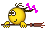 | girl witch | `girl_witch.gif` |
|  | give heart | `give_heart.gif` |
|  | give heart2 | `give_heart2.gif` |
|  | give rose | `give_rose.gif` |
|  | good | `good.gif` |
|  | good2 | `good2.gif` |
|  | good3 | `good3.gif` |
|  | heat | `heat.gif` |
| 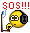 | help | `help.gif` |
|  | hi | `hi.gif` |
| 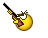 | hunter | `hunter.gif` |
|  | hysteric | `hysteric.gif` |
|  | i'm so happy | `i-m_so_happy.gif` |
|  | ireful1 | `ireful1.gif` |
|  | ireful2 | `ireful2.gif` |
|  | ireful3 | `ireful3.gif` |
|  | king | `king.gif` |
|  | kiss | `kiss.gif` |
|  | kiss2 | `kiss2.gif` |
|  | kiss3 | `kiss3.gif` |
|  | laugh1 | `laugh1.gif` |
|  | laugh2 | `laugh2.gif` |
|  | laugh3 | `laugh3.gif` |
|  | laugh4 | `laugh4.gif` |
| 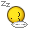 | lazy | `lazy.gif` |
|  | lol | `lol.gif` |
|  | lol2 | `lol2.gif` |
|  | mail1 | `mail1.gif` |
| 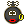 | mamba | `mamba.gif` |
|  | man in love | `man_in_love.gif` |
|  | mda | `mda.gif` |
|  | mega shok | `mega_shok.gif` |
| 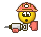 | moil | `moil.gif` |
|  | mosking | `mosking.gif` |
|  | music | `music.gif` |
|  | music2 | `music2.gif` |
|  | nea | `nea.gif` |
|  | negative | `negative.gif` |
|  | new russian | `new_russian.gif` |
|  | ok | `ok.gif` |
|  | on the quiet | `on_the_quiet.gif` |
|  | on the quiet2 | `on_the_quiet2.gif` |
|  | paint2 | `paint2.gif` |
|  | paint3 | `paint3.gif` |
|  | paratrooper | `paratrooper.gif` |
|  | paratrooper girl | `paratrooper_girl.gif` |
|  | pardon | `pardon.gif` |
|  | parting | `parting.gif` |
|  | party | `party.gif` |
|  | party2 | `party2.gif` |
|  | pilot | `pilot.gif` |
|  | pioneer | `pioneer.gif` |
| 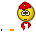 | pioneer smoke | `pioneer_smoke.gif` |
|  | pleasantry | `pleasantry.gif` |
|  | popcorm1 | `popcorm1.gif` |
|  | popcorm2 | `popcorm2.gif` |
|  | prankster2 | `prankster2.gif` |
|  | preved | `preved.gif` |
|  | punish | `punish.gif` |
|  | read | `read.gif` |
|  | rofl | `rofl.gif` |
|  | russian ru | `russian_ru.gif` |
|  | sad | `sad.gif` |
|  | sarcasm | `sarcasm.gif` |
|  | sarcastic | `sarcastic.gif` |
|  | sarcastic blum | `sarcastic_blum.gif` |
|  | sarcastic hand | `sarcastic_hand.gif` |
|  | scare | `scare.gif` |
|  | scaut | `scaut.gif` |
|  | scaut en | `scaut_en.gif` |
|  | scratch one's head | `scratch_one-s_head.gif` |
|  | search | `search.gif` |
|  | secret | `secret.gif` |
|  | sensored | `sensored.gif` |
|  | shok | `shok.gif` |
|  | shout | `shout.gif` |
|  | slow | `slow.gif` |
|  | smile | `smile.gif` |
| 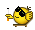 | smoke | `smoke.gif` |
|  | soldier | `soldier.gif` |
|  | soldier girl | `soldier_girl.gif` |
|  | sorry | `sorry.gif` |
|  | sorry2 | `sorry2.gif` |
|  | spruce up | `spruce_up.gif` |
|  | stinker | `stinker.gif` |
|  | sun bespectacled | `sun_bespectacled.gif` |
|  | superman | `superman.gif` |
|  | superstition | `superstition.gif` |
|  | swoon | `swoon.gif` |
|  | tease | `tease.gif` |
|  | tender | `tender.gif` |
|  | thank you2 | `thank_you2.gif` |
|  | this | `this.gif` |
|  | to babruysk | `to_babruysk.gif` |
|  | to become senile | `to_become_senile.gif` |
|  | to pick one's nose | `to_pick_ones_nose.gif` |
|  | to pick one's nose2 | `to_pick_ones_nose2.gif` |
|  | to take umbrage | `to_take_umbrage.gif` |
|  | training1 | `training1.gif` |
|  | umnik2 | `umnik2.gif` |
|  | unknw | `unknw.gif` |
| 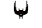 | vampire | `vampire.gif` |
|  | vava | `vava.gif` |
|  | victory | `victory.gif` |
|  | wacko | `wacko.gif` |
|  | wacko2 | `wacko2.gif` |
|  | whistle3 | `whistle3.gif` |
|  | wild | `wild.gif` |
|  | wink | `wink.gif` |
|  | wink2 | `wink2.gif` |
|  | wink3 | `wink3.gif` |
| 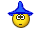 | wizard | `wizard.gif` |
|  | yahoo | `yahoo.gif` |
|  | yes3 | `yes3.gif` |
|  | yess | `yess.gif` |
|  | yu | `yu.gif` |

## Credits

These animated GIF emojis come from the SmileyPak collection by Kolobanga.

Source: <https://kolobanga.ru/en/smileypak>
